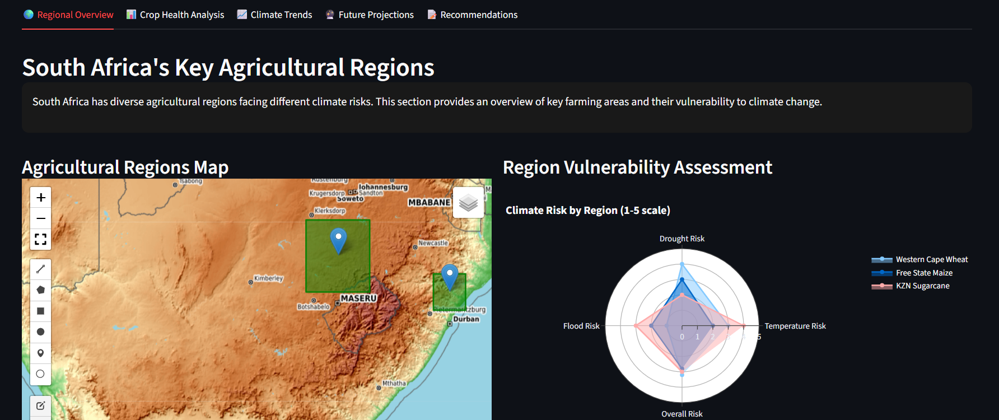

# 🌾 Climate Change Impact on South African Agriculture

A data-driven, interactive web application built to analyze and visualize the impact of climate change on key agricultural regions in South Africa using satellite imagery and climate data.

## 📖 Project Overview

This project addresses the critical challenge of food security under climate change. It transforms complex geospatial and climate data into an intuitive dashboard that enables stakeholders—from farmers to policymakers—to understand past trends, monitor current crop health, and anticipate future risks to South Africa's vital agricultural sector.

The application correlates historical climate data (temperature, rainfall) with satellite-derived vegetation health indices to quantify climate impacts and project future yield vulnerabilities.

## ✨ Features

- **🌍 Regional Risk Assessment:** Interactive map highlighting climate vulnerability of key agricultural regions (Western Cape Wheat Belt, Free State Maize Triangle, KZN Sugarcane Coast).
- **📊 Satellite Imagery Analysis:** Integrates and processes Sentinel-2 L2A data to calculate and visualize vegetation health (NDVI) over time.
- **📈 Trend Analysis:** Interactive charts showing historical trends in temperature, rainfall, and drought frequency from 2010-2023.
- **🔮 Predictive Analytics:** Climate model projections (to 2050) under various emission scenarios to forecast potential impacts on crop yields.
- **🎯 Actionable Insights:** Data-driven recommendations for climate adaptation and resilience strategies tailored to specific regions and crops.

## 🛠️ Tech Stack & Libraries

| Category | Technologies |
| :--- | :--- |
| **Data Processing & Analysis** | Python, Pandas, NumPy, SciKit-Learn |
| **Geospatial Analysis** | GeoPandas, Rasterio, ODC-STAC |
| **Data Visualization** | Plotly, Matplotlib, Leafmap |
| **Web Application Framework** | Streamlit |
| **Data APIs** | Digital Earth Africa STAC API, SA Weather Service Data |
| **Version Control** | Git, DVC (Data Version Control) |

## 📁 Project Structure

climate-agriculture-sa/
│── climate_change_agriculture_sa.py # Main application script
├── requirements.txt # Python dependencies
├── README.md # This file
└── images/ # Files to ignore in Git
    └──dashboard-example.png

## 📊 Data Sources

This project synthesizes data from multiple public sources:

- **Satellite Imagery:** [Sentinel-2 L2A](https://www.esa.int/) via the [Digital Earth Africa](https://www.digitalearthafrica.org/) STAC API.
- **Climate Data:** Historical weather data from the [South African Weather Service (SAWS)](https://www.weathersa.co.za/).
- **Agricultural Data:** Crop yield reports and regional data from [Grain SA](https://www.grainsa.co.za/) and the [Department of Agriculture, Land Reform and Rural Development](https://www.dalrrd.gov.za/).
- **Soil & Topography:** [ISRIC SoilGrids](https://soilgrids.org/) and [NASA SRTM](https://www2.jpl.nasa.gov/srtm/) elevation data.

## 🧠 Methodology

1.  **Data Acquisition:** Automated scripts to download and preprocess satellite imagery (focusing on Red, NIR, and SWIR bands) and climate data.
2.  **Feature Engineering:** Calculated key indices like NDVI (Normalized Difference Vegetation Index) to serve as a proxy for crop health and biomass.
3.  **Trend Analysis:** Used statistical methods and time-series analysis to identify significant trends in climate variables and their correlation with vegetation health.
4.  **Visualization:** Developed an interactive dashboard to make the complex analysis accessible and actionable for non-technical users.

## 📈 Key Insights

- **Temperature Rise:** Identified an average temperature increase of **+1.2°C** across major agricultural regions since 2010.
- **Rainfall Decline:** Observed a **~15% decrease** in annual rainfall in the Western Cape wheat belt, correlating with more frequent drought events.
- **Crop Health Deterioration:** The Crop Health Index, derived from satellite data, shows a measurable decline in key regions, with the most significant impact on rain-fed maize.
- **Future Projections:** Modelling suggests potential yield losses of **20-40% for maize** by 2050 under a high-emission scenario (RCP 8.5), highlighting the urgent need for adaptation strategies.

## 🤝 Contributing

Contributions, ideas, and bug reports are welcome! Feel free to fork the repository and open a Pull Request.

1.  Fork the Project
2.  Create your Feature Branch (`git checkout -b feature/AmazingFeature`)
3.  Commit your Changes (`git commit -m 'Add some AmazingFeature'`)
4.  Push to the Branch (`git push origin feature/AmazingFeature`)
5.  Open a Pull Request

## 📜 License

This project is licensed under the **MIT License** - see the [LICENSE.md](LICENSE.md) file for details. All data sourced from public repositories remains under its original licenses.

## 🙋‍♂️ Author

**Your Name**
- LinkedIn: [Your LinkedIn Profile](https://www.linkedin.com/in/yourprofile/)
- GitHub: [@yourusername](https://github.com/yourusername)
- Portfolio: [Your Portfolio Website](https://yourwebsite.com/)

## 🎯 Acknowledgments

- **Digital Earth Africa** for providing open-access satellite data and APIs.
- **SAWS** and **Grain SA** for making agricultural and climate data publicly available.
- The **Streamlit** team for their fantastic framework that makes building data apps a breeze.
